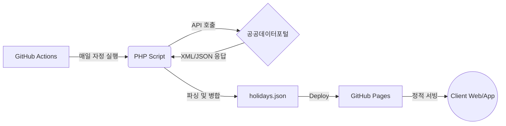

# 📅 KASI Holidays API & Working Day Calculator

> 🚀 **제작:** [**FinalNeoDev** (Final Neo)](https://github.com/FinalNeoDev)


한국천문연구원(KASI)의 특일(공휴일) 정보 데이터를 기반으로 작동하는 **서버리스(Serverless) 공휴일 API 및 영업일 계산기**입니다.
GitHub Actions와 GitHub Pages를 활용하여 별도의 서버 유지비 없이 매일 자정에 최신 공휴일 데이터를 갱신하고 제공합니다.

## 🚀 Live Demo & API Endpoint

* **영업일 계산기 (Web)**: <https://finalneodev.github.io/KASI_Holidays/>
* **공휴일 JSON API**: <https://finalneodev.github.io/KASI_Holidays/holidays.json>

## ✨ 주요 기능 (Features)

1. **완벽한 서버리스 아키텍처**
   * 백엔드 서버(WAS)나 DB 없이 GitHub 인프라만으로 구동되어 트래픽 처리 속도가 빠르고 유지 비용이 **0원**입니다.
2. **4개년 데이터 자동 갱신**
   * 매일 자정(00:00), `작년, 올해, 내년, 내후년` 총 4년 치의 공휴일 데이터를 자동으로 수집하여 JSON 파일로 병합합니다.
3. **영업일(Working Day) 계산기 내장**
   * 제공되는 API를 즉시 활용하여 주말(토/일)과 법정 공휴일을 제외한 실제 업무일 수를 계산해 주는 프론트엔드 UI를 제공합니다.
4. **CORS 프리퍼런스**
   * 정적 파일(JSON)로 서비스되므로 프론트엔드 프로젝트(React, Vue 등)에서 CORS 에러 없이 바로 데이터를 `fetch`하여 사용할 수 있습니다.

## 🛠️ 아키텍처 (How it works)



*(GitHub 내장 Mermaid를 통한 아키텍처 다이어그램)*

## 💻 API 사용 방법 (Usage)

웹이나 앱 프로젝트에서 한국의 공휴일 데이터가 필요할 때, 아래 엔드포인트를 호출하기만 하면 됩니다. API Key가 필요하지 않습니다.

**요청 (GET)**

```javascript
fetch('[https://finalneodev.github.io/KASI_Holidays/holidays.json](https://finalneodev.github.io/KASI_Holidays/holidays.json)')
  .then(response => response.json())
  .then(data => console.log(data));
```

**응답 형식 (JSON)**

```json
{
  "status": "success",
  "last_updated": "2026-05-19 00:00:15",
  "description": "작년, 올해, 내년, 내후년(4개년) 공휴일 통합 데이터",
  "total_count": 72,
  "data": [
    {
      "dateKind": "01",
      "dateName": "1월1일",
      "isHoliday": "Y",
      "locdate": 20250101,
      "seq": 1
    }
    // ...
  ]
}
```

## ⚙️ 직접 구축하기 (Fork & Setup)

이 리포지토리를 포크하여 본인만의 공휴일 서버를 구축하고 싶다면 다음 단계를 따르세요.

1. **Fork** this repository.
2. [공공데이터포털](https://www.data.go.kr/)에서 **'한국천문연구원_특일 정보'** API 활용 신청을 합니다.
3. 발급받은 일반 인증키(Encoding)를 복사합니다.
4. 포크한 리포지토리의 `Settings > Secrets and variables > Actions`로 이동하여 `New repository secret`을 추가합니다.
   * Name: `HOLIDAY_API_KEY`
   * Value: (복사한 인코딩 키 값)
5. `Actions` 탭에서 **Update 3-Year Holiday API Data** 워크플로우를 수동으로 1회 실행합니다.
6. `Settings > Pages`에서 Source를 `gh-pages` 브랜치로 설정하여 배포합니다.

## 📜 Credits & License

* **Data Source**: [공공데이터포털 - 한국천문연구원_특일 정보](https://www.data.go.kr/data/15012690/openapi.do)
* **License**: MIT License
