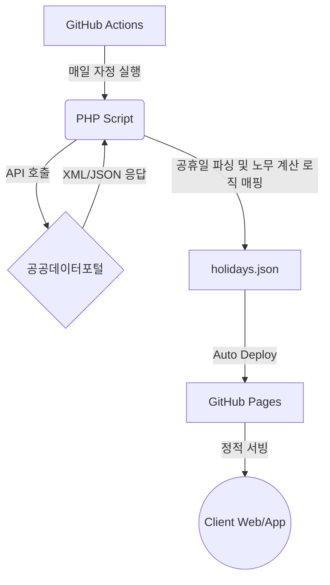

# 📅 Korea Holidays & Labor Calculator

> 🚀 **제작:** [**FinalNeoDev** (Final Neo)](https://github.com/FinalNeoDev)


한국천문연구원(KASI)의 특일(공휴일) 데이터를 기반으로 작동하는 **서버리스 한국 공휴일 API 및 급여·노무 계산기** 프로젝트입니다. 
GitHub Actions와 GitHub Pages를 활용하여 별도의 백엔드 유지비 없이 매일 최신 데이터를 자동 갱신하며, 실제 업무 현장에서 필요한 **영업일 계산, 야간·연장·휴일 근로 수당 계산 기능**을 통합하여 제공합니다.

---

## 🚀 Live Demo & API Endpoint

* **영업일 및 수당 계산기 (Web UI)**: <https://finalneodev.github.io/Korea_Holidays/>
* **공휴일 JSON API**: <https://finalneodev.github.io/Korea_Holidays/holidays.json>

---

## ✨ 주요 기능 (Features)

1. **완벽한 서버리스 아키텍처 (Serverless)**
   * WAS나 DB 서버 없이 GitHub 인프라만으로 구동되어 트래픽 처리 속도가 빠르고 인프라 유지 비용이 **0원**입니다.
2. **4개년 데이터 자동 갱신**
   * 매일 자정(00:00), `작년, 올해, 내년, 내후년` 총 4년 치의 법정 공휴일 및 대체공휴일 데이터를 자동 수집하여 단일 JSON 파일로 병합합니다.
3. **노무 및 급여 계산 유틸리티 확장**
   * **영업일(Working Day) 계산**: 주말과 법정 공휴일을 자동 제외한 실제 프로젝트 수행일 및 영업일 수를 산출합니다.
   * **휴일·야간 수당 계산**: 대한민국 근로기준법(제56조) 기준에 따른 연장근로, 야간근로(22:00 ~ 06:00), 휴일근로 가산 수당(50%~100%)을 정밀 계산합니다.
4. **CORS 프리퍼런스 (CORS-Free)**
   * 정적 JSON 파일로 서빙되므로 React, Vue, Svelte 등 어떤 프론트엔드 환경에서도 CORS 에러 없이 즉시 `fetch`하여 사용할 수 있습니다.

---

## 🛠️ 아키텍처 (How it works)



## 💻 API 사용 방법 (Usage)

### 1. 공휴일 데이터 가져오기 (GET)
별도의 API Key나 회원가입 없이 대한민국 최신 공휴일 배열 데이터를 정적으로 받아옵니다.

```javascript
fetch('[https://finalneodev.github.io/Korea_Holidays/holidays.json](https://finalneodev.github.io/Korea_Holidays/holidays.json)')
  .then(response => response.json())
  .then(data => console.log(data));
```

**응답 형식 (JSON Sample)**
```json
{
  "status": "success",
  "last_updated": "2026-05-19 00:00:15",
  "description": "작년, 올해, 내년, 내후년(4개년) 공휴일 통합 데이터",
  "total_count": 72,
  "data": [
    {
      "dateKind": "01",
      "dateName": "1월1일",
      "isHoliday": "Y",
      "locdate": 20260101,
      "seq": 1
    }
  ]
}
```

### 2. 근로기준법 기반 가산수당 적용 기준
내장된 야근 및 휴일수당 계산 로직은 **대한민국 근로기준법 제56조**를 준수하여 계산됩니다.

| 근로 유형 | 조건 및 기준 | 가산 비율 (통상임금 대비) |
| :--- | :--- | :--- |
| **연장 근로** | 법정 근로시간(1일 8시간, 주 40시간) 초과 분 | 50% 가산 (총 150% 지급) |
| **야간 근로** | 오후 10시(22:00)부터 다음 날 오전 6시(06:00) 사이 근로 | 50% 가산 (총 150% 지급) |
| **휴일 근로 (8시간 이내)** | 공휴일 및 주휴일에 근로한 시간 (8시간 이내) | 50% 가산 (총 150% 지급) |
| **휴일 근로 (8시간 초과)** | 공휴일 및 주휴일에 근로한 시간 중 8시간 초과 분 | 100% 가산 (총 200% 지급) |

> 💡 **수당 중복 가산 규칙:** 예를 들어 휴일에 야간 근로(22시 이후)를 한 경우, 휴일 근로 가산(50%)과 야간 근로 가산(50%)이 중복 적용되어 총 **100%가 가산(통상임금의 200% 지급)**됩니다.

---

## ⚙️ 직접 구축하기 (Fork & Setup)

이 리포지토리를 포크하여 본인만의 커스텀 공휴일 및 노무 API 서버를 구축하려면 다음 단계를 따르세요.

1. 이 리포지토리를 **Fork**합니다.
2. [공공데이터포털](https://www.data.go.kr/)에서 **'한국천문연구원_특일 정보'** API 활용 신청을 진행합니다.
3. 발급받은 **일반 인증키(Encoding)**를 복사합니다.
4. 포크한 리포지토리의 `Settings > Secrets and variables > Actions`로 이동하여 `New repository secret`을 생성합니다.
   * Name: `HOLIDAY_API_KEY`
   * Value: `(복사한 인코딩 키 값)`
5. `Actions` 탭에서 **Update 3-Year Holiday API Data** 워크플로우를 수동으로 1회 실행(Run workflow)합니다.
6. `Settings > Pages`에서 Build and deployment Source를 `gh-pages` 브랜치로 선택하여 배포를 완료합니다.

---

## 📜 Credits & License

* **Data Source**: [공공데이터포털 - 한국천문연구원_특일 정보](https://www.data.go.kr/data/15012690/openapi.do)
* **Rules & Statutes**: 대한민국 근로기준법 제56조 (연장·야간 및 휴일 근로)
* **License**: [MIT License](LICENSE)

---
ℹ️ 코드 패치 및 로직 개선 제안은 언제나 환영합니다! Issue나 Pull Request를 남겨주세요.
